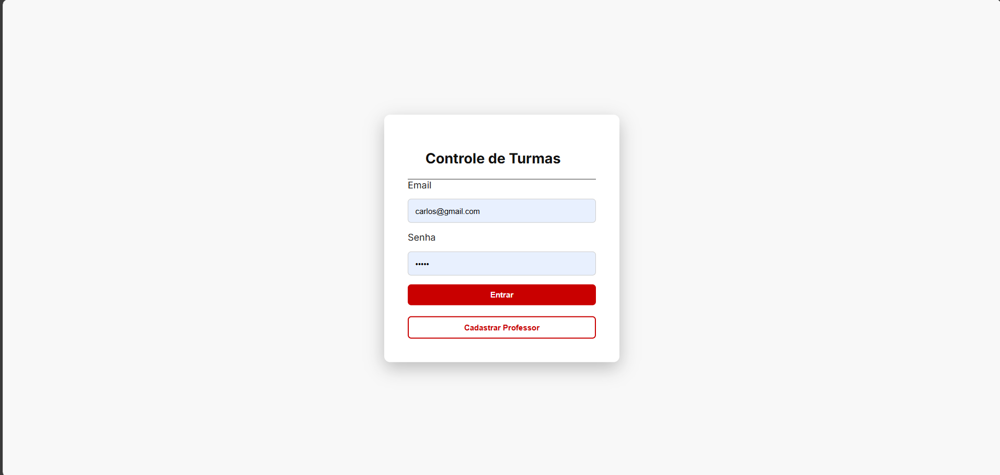
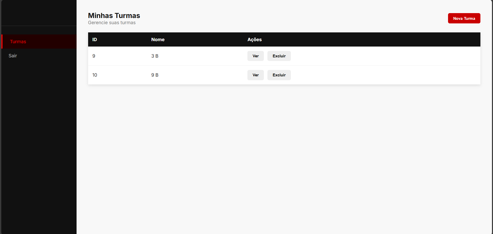
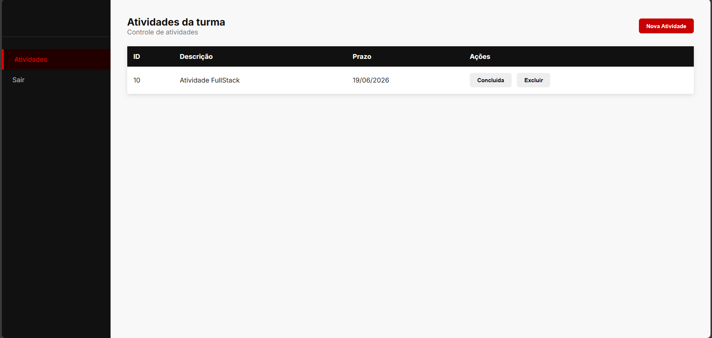

# Escola Avaliação - Controle de Turmas e Atividades

## Descrição

Sistema web desenvolvido para controle de turmas e atividades de professores.

O sistema permite que o professor realize autenticação, cadastre turmas, visualize suas turmas, cadastre atividades, conclua e exclua atividades.

Projeto desenvolvido conforme requisitos da situação de aprendizagem SAEP 2023.1.

---

# Tecnologias utilizadas

## Front-end

* HTML5
* CSS3
* JavaScript
* Fetch API

## Back-end

* Node.js
* Express.js
* Prisma ORM

## Banco de dados

* MySQL
* XAMPP

## Ferramentas utilizadas

* Visual Studio Code
* Insomnia
* Git/GitHub

---

# Requisitos de infraestrutura

## Editor de código

Visual Studio Code

Versão recomendada:
1.90 ou superior

---

## Servidor de aplicação

Node.js

Versão utilizada:

Node.js v22.x

---

## Banco de dados

Sistema Gerenciador de Banco de Dados:

MySQL

Servidor utilizado:

XAMPP

Versão:

8.x

---

# Estrutura do projeto

```
escolaavaliacao

├── api
│   └── Back-end Node.js
│
├── web
│   └── Front-end HTML/CSS/JS
│
└── README.md
```

---

# Como executar o projeto

## 1 - Clonar o repositório

```
git clone https://github.com/CarlosHAlb/escolaavaliacao.git
```

---

# Executando o Back-end

Entrar na pasta:

```
cd api
```

Instalar dependências:

```
npm install
```

Criar o arquivo `.env`

Exemplo:

```
DATABASE_URL="mysql://root:@localhost:3306/turmas_db"
PORT=3000
```

Gerar o Prisma:

```
npx prisma generate
```

Atualizar banco:

```
npx prisma db push
```

Executar servidor:

```
npm run dev
```

Servidor será iniciado em:

```
http://localhost:3000
```

---

# Executando o Front-end

Entrar na pasta:

```
cd web
```

Abrir o arquivo:

```
login.html
```

Recomendado utilizar:

Live Server do Visual Studio Code.

---

# Funcionalidades

## Login

* Autenticação do professor pelo e-mail e senha.

---

## Cadastro de professor

* Permite cadastrar novos professores.

---

## Turmas

* Cadastro de turmas.
* Listagem das turmas do professor.
* Exclusão de turmas.
* Bloqueio de exclusão quando possuir atividades.

---

## Atividades

* Cadastro de atividades.
* Listagem por turma.
* Conclusão de atividades.
* Exclusão de atividades.

---

# Telas do sistema

## Tela de Login



## Tela Principal - Turmas



## Tela de Atividades



---

# Testes da API

As rotas foram testadas utilizando Insomnia.

Principais endpoints:

## Professor

POST

```
/professor/login
```

POST

```
/professor/cadastrar
```

## Turma

GET

```
/turma/listar/professor/:id
```

POST

```
/turma/cadastrar
```

## Atividade

GET

```
/atividade/listar/turma/:id
```

POST

```
/atividade/cadastrar
```

---

# Desenvolvido por

Carlos Henrique

Projeto SENAI 2026
